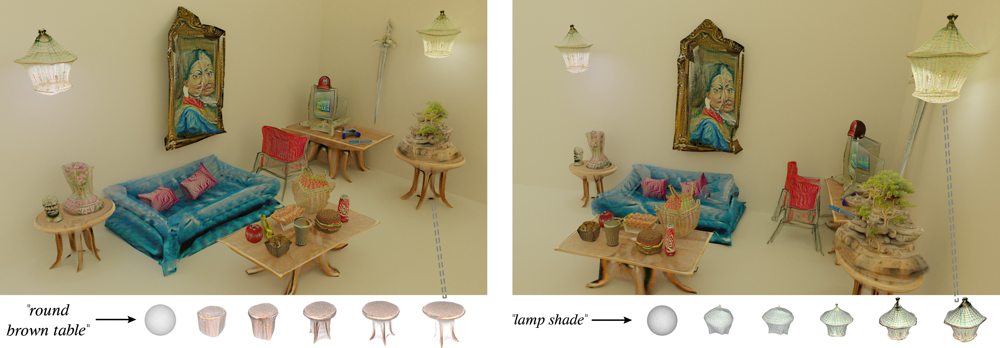
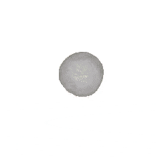
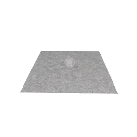
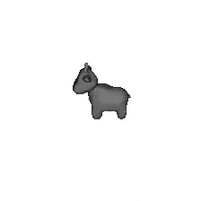

## CLIP-Mesh


## Setup

Clone this repository recursively to get all submodules - use submodule update to get downstream submodules

```
git clone --recurse-submodules https://github.com/NasirKhalid24/CLIP-Mesh.git
cd CLIP-Mesh
git submodule update --init --recursive
```

```

<!-- Install Loop Subdivision -->
cd loop_limitation
pip install .
cd ..

<!-- Install DALLE2 - Diffusion Prior -->
cd DALLE2-pytorch
pip install .
cd ..

<!-- Get DALLE2 Prior Weights -->
mkdir weights
wget https://huggingface.co/spaces/NasirKhalid24/Dalle2-Diffusion-Prior/resolve/main/larger-model.pth -O ./weights/model.pth
```

## launch the container

lauching by the command below. 
```
 CURRENT_UID=$(id -u):$(id -g) docker-compose up -d
```

then get in the container

```
docker exec -it <container_name> bash
```

then inside the container, run the following commands
```
source activate base
CUDA_HOME="/usr/local/cuda"
```

##  for testing main.py

```
python main.py --config configs/single.yml      

```


## for testing translation 
for testing translation with clip, there are three methods.
1. bruteforce
2. autograd
3. optuna
you can test them by 
```
python test_clip_pytorch3d.py -bf -ag -ot
```

## errors

if you find some errors regarding pytorch3d, just install pytorch3d again
```
pip install "git+https://github.com/facebookresearch/pytorch3d.git"
```


<!-- 
Official implementation of [**CLIP-Mesh: Generating textured meshes from text using pretrained image-text models**](https://www.nasir.lol/clipmesh)<br/>

[Nasir Mohammad Khalid](https://www.nasir.lol/),
[Tianhao Xie](https://www.linkedin.com/in/tianhao-xie-440b20186/),
[Eugene Belilovsky](http://eugenium.github.io/),
[Tiberiu Popa](https://users.encs.concordia.ca/~stpopa/index.html)<br/>
_[SIGGRAPH ASIA 2022]() | [arXiv](https://arxiv.org/abs/2203.13333) | [Project page](https://www.nasir.lol/clipmesh)_



## Quickstart

(Work in Progress!) - The following Google Collab notebooks are the best way to get started:

|||
|:-----------------------------------------------------------------------------------------------------------:|:--------------------------------------------------:|
| [Text to Mesh](https://colab.research.google.com/drive/15Fm4EhLlB20EugLUnTdhSJElvGVCU7Ys?usp=sharing)| [Multi Mesh Generation](https://colab.research.google.com/drive/12MbQTjiQ6fyCo4x6Gtp119LFksE8PGkW?usp=sharing) |

|||
|:-----------------------------------------------------------------------------------------------------------:|:--------------------------------------------------:|
| [Stylizing a Mesh](https://colab.research.google.com/drive/1df5yzS2vmqyYko016tVYXYZKt2Hrmy7Q?usp=sharing)| [Apply CLIP-Mesh to Human Models](https://github.com/NasirKhalid24/CLIP-Mesh-SMPLX)| -->


<!--
## Setup

Clone this repository recursively to get all submodules - use submodule update to get downstream submodules

```
git clone --recurse-submodules https://github.com/NasirKhalid24/CLIP-Mesh.git
cd CLIP-Mesh
git submodule update --init --recursive
```

```
 CURRENT_UID=$(id -u):$(id -g) docker-compose up -d
```

Setup Conda environment and install packages

```
conda create -n clip-mesh python=3.7
conda activate clip-mesh
conda install pytorch==1.11.0 torchvision==0.12.0 cudatoolkit=10.2 -c pytorch

pip install -r requirements.txt
```

Install loop subdivison code and DALLE-2 (not that DALLE-2 is from an earlier commit so existing install may not work)
-->

